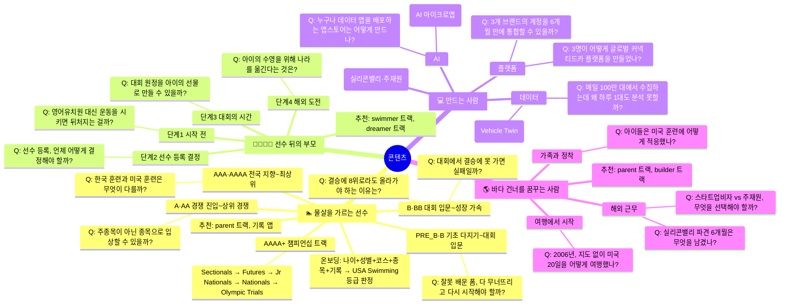

# 마인드맵 ② — 콘텐츠 중심 (Audience-Centered Mindmap)

> 실제 **사용자(독자)**를 뿌리로 하는 지도. 웹사이트의 정보 구조(IA)가 이 파일을 그대로 따른다.
> 독자는 자신의 트랙 콘텐츠를 소비하고, 다른 트랙은 "함께 보면 좋은 콘텐츠"로만 추천된다 (아마존식).

## 독자층 (1단계 선택지)

| 키 | 사용자 친화적 네이밍 | 누구인가 | 맞춤 요소 |
|---|---|---|---|
| `swimmer` | 🏊 **물살을 가르는 선수** | 수영 선수 (유소년~학생 선수) | 나이+성별+코스+종목+기록 입력 → USA Swimming 공식 등급(B~AAAA) 판정 → 등급·연령대·성별 태그 매칭 |
| `parent` | 👨‍👩‍👧‍👦 **선수 뒤의 부모** | 선수(지망) 자녀를 둔 부모 | 자녀 단계(입문/선수등록/전국대회/해외) 선택 |
| `builder` | 💻 **만드는 사람** | 개발자·플랫폼 엔지니어 | 관심사(플랫폼/데이터/AI) 선택 |
| `dreamer` | 🌎 **바다 건너를 꿈꾸는 사람** | 미국 이주·주재원·해외살이 관심층 | 상황(여행/주재원/이민) 선택 |

## 레벨 판정 (swimmer 트랙) — USA Swimming 공식 기준

기준 데이터는 [docs/data/levels.json](../docs/data/levels.json).
**USA Swimming 2024–2028 Motivational Time Standards (Age Group)** 공식 PDF에서 추출한 값으로,
연령대(10&U / 11-12 / 13-14 / 15-16 / 17-18) × 성별(Girls/Boys) × 코스(SCY/SCM/LCM) × 종목별로
**B → BB → A → AA → AAA → AAAA** 등급을 판정한다.

- B 기준보다 느리면 `PRE_B`(기초 단계), AAAA 기준을 여유 있게 넘으면 `AAAA_PLUS`(챔피언십 트랙 후보).
- AAAA 위는 대회 커트 기반 사다리: **Sectionals → Futures → Junior Nationals → Nationals → Olympic Trials** (커트는 대회·연도마다 다르므로 [공식 페이지](https://www.usaswimming.org/times/time-standards)에서 확인).
- 기준은 4년 주기(quad)로 갱신되므로 새 기준 발표 시 `levels.json`을 재생성한다 (README의 갱신 절차 참조).

## 콘텐츠 등록 규칙

1. 글은 `docs/content/<audience>/<slug>.md`로 작성. 제목은 반드시 **질문**.
2. frontmatter 없이 첫 줄 `# 질문`, 마지막에 `> 다음 퍼즐: ...` 링크.
3. `docs/data/contents.json`에 등록. swimmer 글은 `levels`(등급 배열), `ages`(연령대 배열), `sex`(`all`/`F`/`M`)를 태깅해 맞춤 노출에 사용.
4. `related`에는 다른 트랙 글 id를 넣어 교차 추천에 사용.
