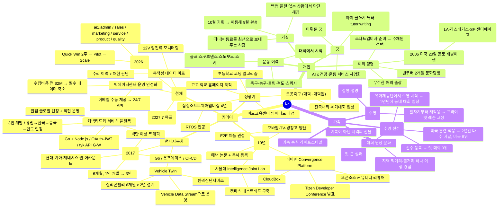

# 마인드맵 ① — 나를 중심으로 (Me-Centered Mindmap)

> "나"를 뿌리로 커리어·개인·가족 히스토리를 가지처럼 펼친 지도.
> 새 경험이 생기면 해당 가지에 노드를 추가한다. (Mermaid mindmap — GitHub에서 그대로 렌더링됨)

## 노드 추가 규칙

- 사실(경험·성과) 단위로 한 줄씩. 해석이나 감상은 [BRAND.md](BRAND.md)에.
- 콘텐츠로 발전시킬 노드에는 `mindmap-content.md`에서 대응하는 콘텐츠 노드를 만든다.
